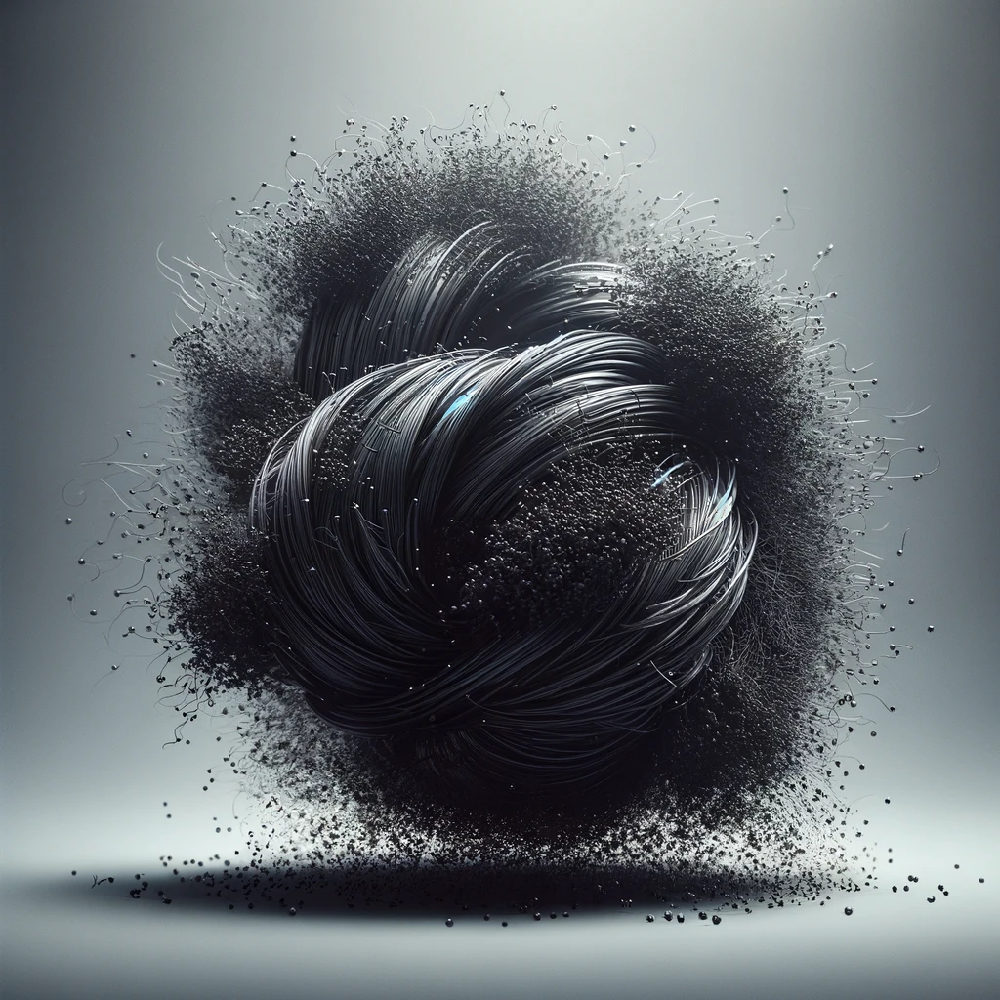

Ad Mortum is an addon for requiem which adds unobtainable features such as:

The Shadow remnant type: An overpowered remnant type that can dissociate at will, destroy it's body and create a new one, making it practically immortal. It can also kill any entity just by flying into it while incorporeal.

The Ethereal Chains effect: Stops the use of Soul Vessels to change your remnant type and slows down demons.

The Obscurus Remnant Type: This one is actually available! You just need to download the origins mod and there it is. It is basically the same as the shadow but has the ethereal chains effect so you are stuck until you change your soul type with origins but even then you are still stuck without being able to use any soul vessels.

The Cloaked Soul Vessel: A soul vessel that makes you a Shadow.

The Dagger: This is still work in progress but using it will(hopefuly) create a pentagram, just be sure to have a full health bar.

The Pentagram: This is still work in progress but it will(hopefuly) apply the ethereal chains effect to all demons that stand on it.

The Crucifix: This is still work in progress but it will(hopefuly) ban any demons in a radius of the user off the server.
